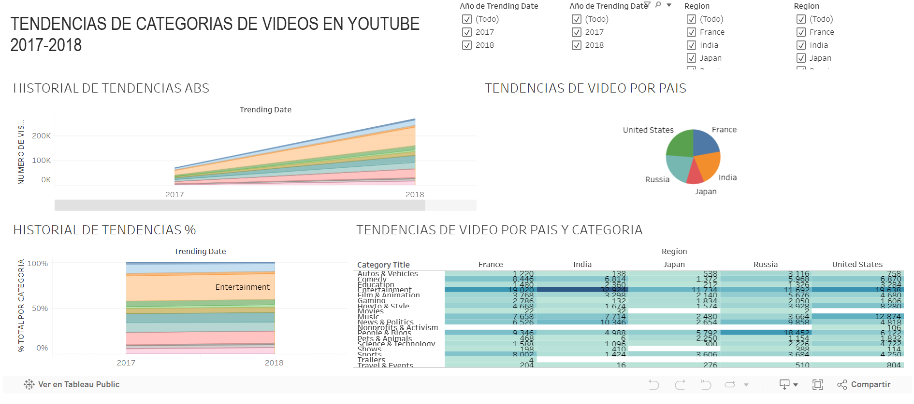

tema: jekyll-theme-minimal
# 👨🏼‍💻👷🏼‍♂️ Data Analyst

## Education
Bachelor's degree in civil engineering 🏗️

## SOBRE MI

¡Hola! Soy Annel, ingeniero civil apasionado por la construcción y también entusiasta del mundo tech.
Me interesé en tecnología porque ofrece mejores oportunidades de ingresos y home office, algo que en obra es difícil por los horarios extendidos.
Busco encontrar un equilibrio: seguir disfrutando de la ingeniería civil mientras desarrollo una segunda carrera tech de forma remota.

  

## Work experience
Construction resident @ Anteus Constructora

### SAO PAULO URBANO 🏢
Residente Encargado de Obra | Edificio de 27 niveles con 4 sótanos

   

Supervisé el ciclo completo del proyecto, desde la planeación hasta la entrega de la estructura, cumpliendo con todos los entregables en tiempo.

Lideré reuniones de coordinación con supervisores y subcontratistas, alineando los programas de trabajo y resolviendo desafíos en obra.

Gestioné negociaciones con el cliente para conciliación de trabajos adicionales, garantizando transparencia y control de costos.

Dirigí a todos los equipos técnicos y de obra en sitio, manteniendo el flujo de trabajo y los estándares de calidad.

### EDIFICIO LANDMARK II 🏢
Residente de Obra | Edificio de 38 niveles con 7 sótanos.

 

Planifiqué y controlé el programa general de construcción, cumpliendo hitos clave dentro de los plazos establecidos.

Supervisé fases estructurales críticas como lanzado de muros de contención, losa de cimentación, sótanos y niveles de torre.

Aseguré la coherencia entre los planos estructurales y arquitectónicos mediante una coordinación proactiva.

Elaboré y actualicé cronogramas para la entrega oportuna de la estructura.

### EDIFICIO VIANTO AMÉRICAS 1331 🏢
Residente Encargado de Obra | Edificio de media altura con 3 sótanos

  

  

 

Gestioné la ejecución del proyecto desde la excavación hasta la terminación de elementos estructurales como zapatas y columnas.

Coordiné actividades complejas como movimiento de tierras, lanzado de muros de contención y colocación de trabes de liga en pilotes.

Supervisé la revisión de nómina y verifiqué el avance de obra conforme al alcance y presupuesto del proyecto.

# Projects
### TripleTen Bootcamp Data Analyst

### 🎮 Análisis de Ventas y Perfil de Videojuegos para la Tienda Ice

  

  

En este proyecto analicé datos históricos de videojuegos para identificar los factores que impulsan su éxito comercial. Mi objetivo fue ayudar a la tienda online Ice a detectar productos prometedores y optimizar sus campañas publicitarias para 2017, basándome en datos reales y análisis estadísticos.

Apliqué técnicas de análisis exploratorio, visualización, pruebas de hipótesis y segmentación por región, utilizando Python, pandas, matplotlib, seaborn y scipy en Jupyter Notebook.

¿El resultado? Un enfoque claro y basado en datos que facilita la toma de decisiones estratégicas, aumentando las probabilidades de éxito en marketing y ventas.

### 📊 Dashboard de análisis de tendencias de videos en YouTube Sterling & Draper – Proyecto Sprint 12 (Análisis de Datos)

  

  

Trabajé como analista de datos para una agencia de publicidad, donde analicé tendencias de videos en YouTube por región y categoría. Automatizé el procesamiento de datos y diseñé un dashboard interactivo en Tableau para que el equipo de marketing pudiera responder rápido a preguntas clave sobre popularidad de contenidos.

### 📊 Análisis de industria editorial mediante SQL Proyecto de análisis de datos – SQL
Analicé una base de datos de una startup editorial para detectar oportunidades de negocio durante la pandemia. Usé consultas avanzadas en SQL para identificar tendencias en libros, autores y comportamiento de usuarios.
¿Qué logré? Transformar grandes volúmenes de datos en insights accionables, apoyando el diseño de nuevos productos dirigidos a lectores frecuentes.

### 📊 Análisis de Preferencias Musicales entre Springfield y Shelbyville
Este proyecto tuvo como objetivo analizar los hábitos de consumo musical online en dos ciudades distintas: Springfield y Shelbyville, y comprobar si existen diferencias en la actividad de los usuarios según la ciudad y el día de la semana. Para ello, se desarrolló un análisis en tres etapas principales, aplicando técnicas de análisis de datos y pruebas estadísticas.

Estudié los hábitos de consumo musical online en dos ciudades distintas, aplicando técnicas de limpieza de datos, análisis exploratorio y pruebas estadísticas.
¿Qué logré? Confirmar si existían diferencias de comportamiento entre las ciudades y demostrar cómo los datos pueden validar (o refutar) supuestos estratégicos de negocio.
